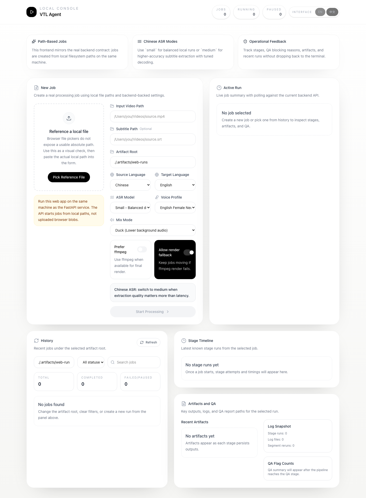
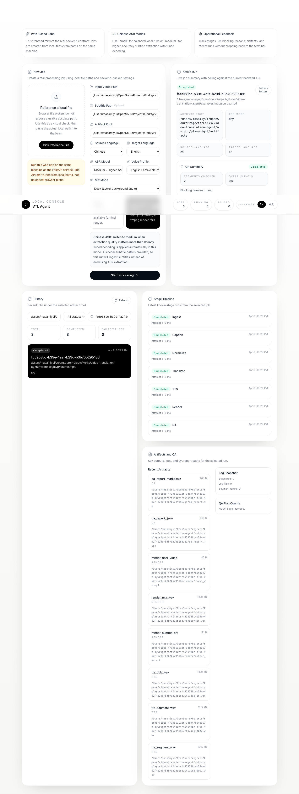

[简体中文](./README.zh-CN.md) · **English**

# video-translation-agent

Local-first Phase 1 MVP for video translation and dubbing, with one shared in-process engine exposed through a Typer CLI and a FastAPI app.

This repo is useful today for local experiments and personal workflows, especially when you already have a subtitle sidecar. It is better than the earlier pure-placeholder path, but it is still **not production-grade translation or dubbing**.

## Current behavior at a glance

- Pipeline stages: `ingest -> caption -> normalize -> translate -> tts -> render -> qa`
- Jobs persist under a local artifact workspace with `job.json` plus append-only JSONL histories
- CLI supports: `run`, `stage run`, `segment rerun`, `config init/show/validate`, `doctor`, `completion show/install`
- API supports: health, create/list/get job, artifacts/logs/qa reads, stage rerun, segment rerun
- Caption strategy defaults to `auto`: **subtitle sidecar is preferred when provided**, otherwise the pipeline falls back to local ASR/media translation behavior
- Default ASR model is `small`; for Chinese voice-only extraction you can opt into `medium` for higher accuracy at higher CPU cost
- For subtitle-sourced Chinese jobs, the pipeline prefers **offline text translation** over audio-derived translation; this is the better path for curated manual subtitles
- For non-subtitle jobs, translation falls back to **media translation from the source video**
- TTS uses local fallback synthesis; on macOS it can use **`say` + `afconvert`** to generate spoken audio instead of the older sine-wave placeholder
- Render prefers `ffmpeg`; on macOS, if `ffmpeg` is unavailable or fails and fallback is allowed, the app can use **AVFoundation via `swift`** to produce a dubbed MP4 **without burned subtitles**

## Reality check / quality bar

What improved:

- Subtitle-driven Chinese -> English jobs are materially better than before
- macOS native fallbacks can produce spoken English audio and a dubbed MP4 even without `ffmpeg`
- Real local runs now complete end-to-end with persisted artifacts

What this is **not**:

- not a polished translation system
- not studio-quality dubbing
- not robust enough yet for unattended production media pipelines

## Requirements

- Python 3.11+
- `ffprobe` on `PATH` is preferred for ingest/doctor
- On macOS, media probing can fall back to native tools via `mdls` / `swift`
- `ffmpeg` is recommended, but optional when fallback render paths are allowed
- On macOS, `say` + `afconvert` improves fallback TTS quality
- On macOS, `swift` enables the AVFoundation dubbed-video fallback path

Recommended install:

```bash
python -m pip install -e '.[dev]'
```

Verification test suite:

```bash
python -m pytest
```

## Example inputs

Documented fixture files live under `examples/mvp/`:

- `examples/mvp/source.srt`
- `examples/mvp/source.mp4` (placeholder bytes for deterministic tests, **not** a real video)
- `examples/mvp/vtl.config.json`

Notes:

- `tests/test_mvp_documented_flow.py` keeps the documented fixture flow honest
- For real local runs, replace `examples/mvp/source.mp4` with an actual media file
- Generated job outputs are intentionally **not** committed under `examples/mvp/`

## How the pipeline chooses its path

### 1) Caption input

- If `input_subtitle` is provided, the subtitle sidecar is the source of truth
- Otherwise `caption_strategy=auto` falls back to local audio-derived captioning
- For Chinese ASR, `small` is the default balance; `medium` is available as a slower high-accuracy mode

### ASR model notes

- Default: `small`
- High-accuracy Chinese mode: `medium`
- When `asr_model=medium` and `source_lang=zh`, the app disables Whisper `condition_on_previous_text` to reduce long-span repetition/hallucination loops seen in local CPU runs
- `medium` is materially slower than `small`; in local tests it improved weighted CER but took about `2.24x` longer

### 2) Translation

- Subtitle-sourced Chinese jobs prefer offline text translation instead of re-translating from audio
- Non-subtitle jobs use media translation from the source video as the fallback path
- Translation quality is still best-effort; current local logic includes some domain overrides/cleanup and optional offline MT behavior

### 3) TTS

- Default local fallback remains available for deterministic runs
- On macOS, `say` + `afconvert` can synthesize spoken WAV clips and usually sounds much better than the placeholder tone path

### 4) Render

- Preferred path: `ffmpeg` creates `mix.wav` and `final_en.mp4`
- If that fails and fallback is allowed on macOS, AVFoundation muxing can still create a dubbed `final_en.mp4`
- **Fallback-rendered MP4s do not burn subtitles into the video**
- If AVFoundation is also unavailable, the last-resort local copy fallback keeps artifacts moving, but the copied MP4 is just the source video

## CLI usage

Show help:

```bash
python -m apps.cli.main --help
```

Run doctor:

```bash
python -m apps.cli.main doctor --artifact-root ./.artifacts/mvp-jobs

# make ffmpeg a hard requirement
python -m apps.cli.main doctor \
  --artifact-root ./.artifacts/mvp-jobs \
  --no-allow-render-copy-fallback
```

Run with the documented fixture:

```bash
python -m apps.cli.main run \
  --config ./examples/mvp/vtl.config.json \
  --job-id 00000000-0000-0000-0000-000000000260 \
  --no-prefer-ffmpeg
```

Real local run with an actual video and subtitle sidecar:

```bash
python -m apps.cli.main run \
  --input-video ./我是不白痴.mp4 \
  --input-subtitle ./我是不白痴.srt \
  --source-lang zh \
  --target-lang en \
  --artifact-root ./.artifacts/wobubaichi-run-v5 \
  --no-prefer-ffmpeg
```

Real local run without sidecar subtitles, using higher-accuracy Chinese ASR:

```bash
python -m apps.cli.main run \
  --input-video ./我在迪拜等你.mp4 \
  --source-lang zh \
  --target-lang en \
  --asr-model medium \
  --artifact-root ./.artifacts/dubai-medium-run \
  --no-prefer-ffmpeg
```

Stage rerun:

```bash
python -m apps.cli.main stage run translate \
  --job-id 00000000-0000-0000-0000-000000000260 \
  --artifact-root ./.artifacts/mvp-jobs \
  --no-prefer-ffmpeg
```

Segment rerun:

```bash
python -m apps.cli.main segment rerun seg_0001 \
  --job-id 00000000-0000-0000-0000-000000000260 \
  --artifact-root ./.artifacts/mvp-jobs \
  --reason "manual fix" \
  --execute-stages \
  --no-prefer-ffmpeg
```

Config helpers:

```bash
python -m apps.cli.main config init --output ./vtl.config.json
python -m apps.cli.main config validate --config ./vtl.config.json
python -m apps.cli.main config show --config ./vtl.config.json
```

Notes:

- `run --mode remote` is not implemented in this phase
- `config init` can write `.json` or `.yaml`; TOML write is not supported
- `--asr-model medium` is currently the recommended high-accuracy option for Chinese ASR-only runs when extra latency is acceptable

## API usage

Start the API:

```bash
python -m uvicorn apps.api.main:app --reload
```

Health checks:

```bash
curl -s http://127.0.0.1:8000/api/v1/health
curl -s http://127.0.0.1:8000/api/v1/health/ready
```

Create a local job:

```bash
curl -s -X POST http://127.0.0.1:8000/api/v1/jobs \
  -H 'content-type: application/json' \
  -d '{
    "job_id": "00000000-0000-0000-0000-000000000350",
    "input_video": "./examples/mvp/source.mp4",
    "input_subtitle": "./examples/mvp/source.srt",
    "artifact_root": "./.artifacts/mvp-jobs",
    "asr_model": "medium",
    "prefer_ffmpeg": false,
    "allow_render_copy_fallback": true
  }'
```

Notes:

- `asr_model` is optional on the API; omit it to keep the default `small`
- For Chinese ASR-only jobs, `"asr_model": "medium"` enables the higher-accuracy tuned decode path

Inspect job state and outputs:

```bash
curl -s "http://127.0.0.1:8000/api/v1/jobs?artifact_root=./.artifacts/mvp-jobs"
curl -s "http://127.0.0.1:8000/api/v1/jobs/00000000-0000-0000-0000-000000000350?artifact_root=./.artifacts/mvp-jobs"
curl -s "http://127.0.0.1:8000/api/v1/jobs/00000000-0000-0000-0000-000000000350/artifacts?artifact_root=./.artifacts/mvp-jobs"
curl -s "http://127.0.0.1:8000/api/v1/jobs/00000000-0000-0000-0000-000000000350/logs?artifact_root=./.artifacts/mvp-jobs"
curl -s "http://127.0.0.1:8000/api/v1/jobs/00000000-0000-0000-0000-000000000350/qa?artifact_root=./.artifacts/mvp-jobs"
```

Rerun through the API:

```bash
curl -s -X POST "http://127.0.0.1:8000/api/v1/jobs/00000000-0000-0000-0000-000000000350/stages/translate/rerun" \
  -H 'content-type: application/json' \
  -d '{"artifact_root":"./.artifacts/mvp-jobs","prefer_ffmpeg":false,"allow_render_copy_fallback":true}'

curl -s -X POST "http://127.0.0.1:8000/api/v1/jobs/00000000-0000-0000-0000-000000000350/segments/seg_0001/rerun" \
  -H 'content-type: application/json' \
  -d '{"artifact_root":"./.artifacts/mvp-jobs","reason":"api rerun","execute_stages":true,"prefer_ffmpeg":false,"allow_render_copy_fallback":true}'
```

## Web console

The repo also ships a local web console under `apps/web/`. It is path-based rather than upload-based: run the frontend on the same machine as the FastAPI service, then paste local video/subtitle paths into the form.

Start the API:

```bash
python -m uvicorn apps.api.main:app --reload
```

Start the frontend:

```bash
cd apps/web
npm install
npm run dev -- --host 127.0.0.1 --port 5173
```

Then open `http://127.0.0.1:5173`.

Notes:

- The header language switch supports both English and Chinese UI copy
- `ASR Model = medium` is surfaced directly in the form for higher-accuracy Chinese ASR runs
- If `Subtitle Path` is provided, the job will ingest the sidecar instead of exercising ASR extraction

English home screen:



Completed run view:



## Artifact layout

For a job at `<artifact_root>/<job_id>/`:

- Top-level files
  - `job.json`
  - `stage_runs.jsonl`
  - `artifacts.jsonl`
  - `segments.jsonl`
  - `segment_reruns.jsonl` (present after segment reruns)
- Stage directories
  - `ingest/media_info.json`
  - `caption/source_zh.raw.json`
  - `normalize/source_zh.cleaned.json`
  - `normalize/source_zh.srt`
  - `translate/en_subtitle.json`
  - `translate/en_subtitle.srt`
  - `translate/en_dub_text.json`
  - `translate/en_dub_text.txt`
  - `tts/seg_*.wav`
  - `tts/dub_en.wav`
  - `render/output_en.srt`
  - `render/mix.wav`
  - `render/final_en.mp4`
  - `qa/qa_report.json`
  - `qa/qa_report.md`
- `input/` and `logs/` directories may exist and may be empty in current runs

A recent successful real run artifact root is:

```text
.artifacts/wobubaichi-run-v5/00000000-0000-0000-0000-000000009105/
```

That run used `我是不白痴.mp4` plus a manual SRT, completed all seven stages, and produced:

- subtitle-driven Chinese -> English outputs under `translate/`
- spoken WAV clips plus `tts/dub_en.wav`
- `render/final_en.mp4` and `render/output_en.srt`
- `qa/qa_report.json` and `qa/qa_report.md`

## Known limitations

- This is still a local MVP, not a production media pipeline
- Best results currently come from jobs that already have a curated subtitle sidecar
- Non-subtitle jobs rely on local ASR/media translation fallback and are less predictable
- Subtitle quality and dub quality can diverge because subtitle text and dubbing text are stored separately
- Fallback-rendered MP4s do **not** burn subtitles into the video
- On macOS, AVFoundation fallback can produce a dubbed MP4; if that path is unavailable, the final copy fallback preserves the source MP4 without dubbed audio muxed in
- `doctor` hard-blocks `python`, `ffprobe`/macOS probe fallback, and artifact-root writability by default; `ffmpeg` only becomes hard-blocking when you disable render fallback while preferring ffmpeg
- QA can pause a job and cause the CLI to exit with the QA-blocked code

## Verification references

- `tests/test_mvp_documented_flow.py`
- `tests/test_cli_smoke.py`
- `tests/test_api_smoke.py`
