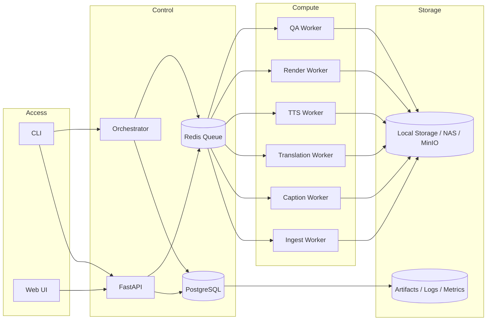
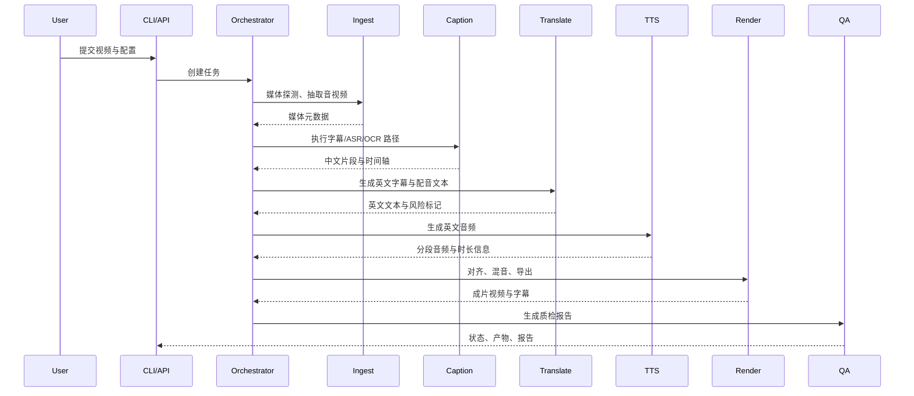

# 视频本地化翻译与配音系统技术方案说明书

文档版本：v1.0  
文档状态：Draft  
编写日期：2026-04-01  
适用范围：内部部署、本地优先的视频翻译与配音处理系统

---

## 1. 文档概述

### 1.1 文档目的

本文档用于定义“视频本地化翻译与配音系统”的技术方案、系统边界、核心架构、CLI 运行模式、数据模型、处理流程、部署建议与实施计划，为系统设计、研发实现、联调测试及后续迭代提供统一依据。

### 1.2 项目目标

本项目面向中文输入视频，构建一套本地优先、可批量执行、可审计、可重跑的视频本地化处理系统。系统目标如下：

- 输入中文视频，输出英文字幕、英文配音及英文成片视频
- 支持外挂字幕、语音识别、硬字幕 OCR 等多种输入路径
- 支持中间产物落盘、失败重试、单阶段重跑与单片段返工
- 在第一阶段满足内部交付可用性，不以电影级口型同步为目标
- 在工程架构上优先保证稳定性、可观测性和可维护性

### 1.3 建设原则

- 流水线优先：核心能力采用确定性媒体处理流水线实现
- Agent 增强：Agent 用于高不确定性节点的辅助决策与返工，不承担主链路控制
- 本地优先：字幕识别、翻译、配音与合成优先在本地完成
- 可审计：每个阶段保留中间产物和日志，支持过程追踪
- 可重跑：支持任务级、阶段级、片段级重跑

### 1.4 文档适用方式

本文档同时承担两类作用：

- 作为项目整体路线图，描述目标态架构与后续演进方向
- 作为第一阶段实现基线，给出可直接落地的默认边界与接口约束

为避免实现时产生歧义，本文档约定如下：

- 若“目标态架构”与“第一阶段默认实现”存在差异，以“第一阶段默认实现”为准
- 第一阶段默认范围为：`CLI + API`、外挂字幕与 ASR 路径、预置音色 TTS、单机本地优先
- Review UI、OCR、语音克隆、强口型同步、分布式服务化拆分均属于后续阶段扩展能力

---

## 2. 系统定位与边界

### 2.1 系统定位

本项目在技术上应定位为“视频本地化流水线系统”，而非从第一阶段开始构建的“通用自主 Agent 系统”。

系统主链路由以下确定性阶段组成：

- 媒体探测
- 字幕提取
- 文本清洗与标准化
- 翻译
- TTS 配音
- 时长对齐
- 混音与渲染
- 质检与审核报告输出

Agent 能力作为上层增强模块，负责如下高不确定性任务：

- 路径选择
- 术语一致性修订
- 时长超限文本重写
- 高风险片段识别
- 审核摘要生成

### 2.2 输入范围

系统支持以下输入类型：

1. 视频文件 + 中文外挂字幕文件
2. 视频文件，存在中文语音音轨但无外挂字幕
3. 视频文件，字幕硬烧录在画面中，需要 OCR 提取

第一阶段可选输入包括：

- 术语表或品牌词表
- 目标语言风格要求
- 目标配音角色设定（预置音色 profile）
- 输出字幕格式要求

后续阶段可扩展输入包括：

- 参考音色样本（仅在引入语音克隆后启用）

### 2.3 输出范围

系统至少输出以下产物：

- 英文字幕文件 `output_en.srt`
- 英文配音音轨 `dub_en.wav`
- 英文成片视频 `final_en.mp4`
- 任务元数据文件 `job.json`
- 质检报告 `qa_report.json` 与 `qa_report.md`

### 2.4 非目标范围

第一阶段不纳入以下目标：

- 强口型同步
- 多说话人高保真语音克隆
- 零人工审核自动上线
- 任意语言到任意语言的通用翻译平台
- 由 Agent 完整自主规划媒体处理链路

---

## 3. 总体方案结论

### 3.1 可行性结论

该项目具备较高工程可行性，且符合典型的多阶段媒体处理系统特征。通过控制第一阶段范围、采用稳定的本地模型组合，并保留人工审核环节，可以在较短周期内实现内部可用版本。

### 3.2 分阶段复杂度判断

| 场景 | 描述 | 复杂度 | 第一阶段建议 |
|---|---|---:|---:|
| A | 已有中文外挂字幕 | 中 | 是 |
| B | 无外挂字幕，仅有中文音轨 | 中高 | 是 |
| C | 画面硬字幕，需要 OCR | 高 | 否 |
| D | 要求保持原说话人音色 | 高 | 否 |
| E | 要求高强度口型同步 | 很高 | 否 |

### 3.3 第一阶段推荐目标

第一阶段建议聚焦于如下闭环：

- 输入：中文视频
- 输出：英文字幕、英文配音、英文合成视频
- 技术路径：外挂字幕优先，其次 ASR
- 工程目标：稳定可批量运行、可重跑、可审核

### 3.4 第一阶段默认落地约束

作为第一阶段默认实现，建议采用以下明确约束：

| 维度 | 第一阶段默认值 |
|---|---|
| 接入方式 | `CLI + API`，不建设 Review UI |
| 运行依赖 | 除模型运行时外尽量 0 外部依赖 |
| 元数据存储 | 本地文件清单或 SQLite |
| 调度方式 | 进程内编排与本地执行器，不强制引入 Redis / Celery |
| 支持路径 | 外挂字幕、ASR |
| 暂不支持 | OCR、语音克隆、强口型同步 |
| 配音能力 | 预置英文音色，不接受参考音色克隆 |
| 重跑边界 | 任务级、阶段级、片段级 |

---

## 4. 总体架构设计

### 4.1 架构分层

系统整体分为四层：

1. 接入层：CLI、API、内部工具调用入口（Review UI 为后续扩展）
2. 控制层：API、编排器、任务状态管理（第一阶段可内嵌为单进程）
3. 计算层：字幕提取、标准化、翻译、TTS、渲染等 Worker 或本地执行器
4. 存储层：任务产物、日志、元数据与缓存

### 4.2 逻辑架构



说明：

- 上图描述的是目标态逻辑架构，而非第一阶段唯一实现形态
- 第一阶段默认不强制引入 Web UI、PostgreSQL、Redis 与独立 Worker 进程
- 第一阶段推荐实现为：`CLI/API + in-process orchestrator + local metadata store + local filesystem artifacts`
- 当进入多人协作、服务化部署或并发提升阶段时，再演进到 `PostgreSQL + Redis + Worker` 拆分架构

### 4.3 架构原则

- CLI 与 API 共用统一配置模型
- 编排层只负责流程组织与状态流转，不承载模型推理逻辑
- 各处理阶段以标准化文件与结构化 JSON 作为阶段边界
- 中间结果强制落盘，便于调试与回归
- 目标态允许服务化拆分，但第一阶段默认支持单机单进程或单机内嵌执行器模式

---

## 5. 核心处理流程设计

### 5.1 标准处理时序



### 5.2 输入路径策略

系统应支持以下三类字幕提取路径：

#### 路径 A：外挂字幕路径

适用于已存在 SRT/ASS/VTT 字幕文件的场景。  
该路径工程复杂度最低，时间轴天然存在，适合作为第一阶段主路径。

流程如下：

1. 读取字幕文件
2. 执行文本清洗与标准化
3. 进行重切片
4. 执行翻译
5. 生成字幕版文本与配音版文本
6. 执行 TTS 与音视频合成

#### 路径 B：ASR 路径

适用于无外挂字幕、但存在中文语音音轨的场景。  
该路径适合内部课程、访谈、讲解类视频。

流程如下：

1. 提取单声道音轨
2. 执行 VAD 切段
3. 执行 ASR 识别
4. 执行标点恢复（Punctuation Restoration）
5. 执行词级或句级对齐
6. 执行文本清洗与标准化
7. 进入翻译、配音与合成阶段

> 注：`faster-whisper` 默认携带标点输出，但中文场景效果因语料而异。`WhisperX` 可搭配 `deepmultilingualpunctuation` 补充此能力。建议在进入翻译阶段前验证标点质量，避免断句错误影响译文准确性。

#### 路径 C：OCR 路径

适用于画面存在硬字幕、但无外挂字幕和有效音轨信息的场景。  
该路径复杂度较高，建议作为第二阶段能力建设。

流程如下：

1. 抽帧
2. 确定字幕区域
3. 图像增强
4. OCR 识别
5. 连续帧聚类与去重
6. 恢复字幕出现与消失时间
7. 进入翻译、配音与合成阶段

---

## 6. 模块设计

### 6.1 媒体探测模块

职责：

- 获取视频编码信息
- 获取音轨信息
- 获取时长、帧率、分辨率
- 判断是否存在字幕流
- 为后续路径选择提供依据

推荐工具：

- `ffprobe`
- `ffmpeg`

建议命令：

```bash
ffprobe -v quiet -print_format json -show_streams -show_format input.mp4
```

### 6.2 字幕提取模块

职责：

- 解析外挂字幕
- 基于 ASR 生成字幕片段
- 基于 OCR 提取硬字幕
- 生成统一结构的片段数据

统一输出结构建议：

```json
{
  "segment_key": "seg_0001",
  "start_ms": 0,
  "end_ms": 2130,
  "text": "我们下周会上线这个功能。",
  "confidence": 0.94,
  "words": [
    {"word": "我们", "start_ms": 20, "end_ms": 310},
    {"word": "下周", "start_ms": 350, "end_ms": 700}
  ]
}
```

### 6.3 文本清洗与标准化模块

职责：

- 去除重复字幕与噪声文本
- 统一标点、数字、繁简体
- 统一专有名词
- 按时长、字符数、停顿位置进行重切片

建议约束：

- 单条字幕时长：1.0s 至 6.0s
- 英文字幕阅读速度：12 至 18 cps
- 英文字幕优先控制为 1 至 2 行

### 6.4 翻译模块

职责：

- 将中文片段翻译为英文字幕文本
- 为配音生成更适合时长控制的简化文本
- 应用术语表约束
- 标记潜在风险片段

建议双轨文本输出：

- `subtitle_text`：面向字幕展示，信息较完整
- `dubbing_text`：面向配音生成，优先控制长度与口语性

建议输出结构：

```json
[
  {
    "segment_key": "seg_0001",
    "subtitle_text": "This feature will officially launch next week.",
    "dubbing_text": "This feature goes live next week.",
    "risk_flags": ["none"]
  }
]
```

### 6.5 配音模块

职责：

- 对每个片段执行英文 TTS
- 获取音频真实时长
- 与目标时长比较并触发修复策略
- 缓存重复生成结果

第一阶段约束：

- 仅使用预置英文音色 profile
- 不引入参考音色样本驱动的语音克隆

时长修复优先级建议如下：

1. 优先压缩 `dubbing_text`
2. 再调整语速
3. 最后裁剪静音或做轻微音频级微调

推荐缓存键：

```text
sha256(model_id + voice_id + speed + text)
```

### 6.6 对齐与渲染模块

职责：

- 根据片段时间轴拼接音频
- 在空白区间补齐静音
- 保留必要环境音或背景音
- 执行混音、字幕烧录与视频导出

建议支持三类混音模式：

- `replace`：原音静音，仅保留英文配音
- `duck`：原音保留，说话段压低背景；建议默认衰减 -14dB，淡入/淡出各 100ms，具体参数应作为配置项暴露，以适应不同背景音强度场景
- `stem`：基于人声分离进行高质量混音（需引入 `Demucs` 等人声分离模型，建议第二阶段引入）

第一阶段推荐采用 `duck` 模式。

### 6.7 QA 模块

职责：

- 检测低置信度片段
- 检测缺失翻译与术语漂移
- 检测 TTS 超时、音频削波、响度问题
- 输出结构化审核报告

建议风险标签：

- `asr_low_confidence`
- `ocr_low_confidence`
- `term_inconsistency`
- `too_long_for_dubbing`
- `tts_duration_overrun`
- `missing_translation`
- `audio_clipping_risk`
- `manual_review_required`

第一阶段默认阻断策略建议如下：

- 任意片段出现 `missing_translation`：任务进入 `paused`
- 任意片段出现 `audio_clipping_risk`：任务进入 `paused`
- `failed` 片段占比 `> 20%`：任务进入 `paused`
- `asr_low_confidence` 或 `ocr_low_confidence` 片段占比 `> 15%`：任务进入 `paused`
- 经过修复后仍存在 `tts_duration_overrun` 的片段占比 `> 10%`，或任意片段超出目标时长 `1000ms` 以上：任务进入 `paused`

第一阶段默认阈值建议如下：

- `asr_low_confidence`：`asr_confidence < 0.80`
- `ocr_low_confidence`：`ocr_confidence < 0.85`

以上阈值应作为配置项暴露，而不是写死在实现中。

---

## 7. Agent 能力边界设计

### 7.1 设计原则

Agent 能力仅作为辅助增强层，不应直接负责主链路媒体处理。  
字幕识别、翻译调用、TTS 推理、媒体合成等能力应由确定性程序完成。

### 7.2 Agent 适用场景

建议将 Agent 用于以下能力：

1. 路径选择：在外挂字幕、ASR、OCR 之间做策略选择
2. 翻译修订：优化过长或过书面的英文文案
3. 时长修复：针对 TTS 超时片段生成更短配音文本
4. QA 辅助：总结高风险片段及返工建议
5. 审核摘要：生成面向人工审核的任务摘要

---

## 8. 技术选型建议

### 8.1 ASR 与对齐

主方案：

- `faster-whisper`
- `WhisperX`

备选方案：

- `SenseVoice`

选型建议：

- 第一阶段优先采用 `faster-whisper + WhisperX`
- 如内部中文视频占比极高，可对 `SenseVoice` 做 A/B 验证

### 8.2 OCR

主方案：

- `PaddleOCR`

选型建议：

- 第二阶段引入
- 优先采用字幕区域 OCR，而非全帧 OCR

### 8.3 翻译

主方案：

- `Qwen2.5-7B-Instruct`
- `Qwen2.5-14B-Instruct`

回退方案：

- `NLLB-200`

选型建议：

- 第一阶段使用本地指令型 LLM 作为主翻译引擎
- NLLB 用于批量离线基线或回退

### 8.4 TTS

第一阶段：

- `MeloTTS`

第二阶段：

- `CosyVoice`

增强项：

- `GPT-SoVITS`

### 8.5 媒体处理

主工具：

- `FFmpeg`

应用范围：

- 抽轨
- 抽帧
- 拼接
- 混音
- 调速
- 烧录字幕
- 导出成片

---

## 9. CLI 技术设计

### 9.1 设计目标

CLI 是系统的一级入口，必须满足以下要求：

- 支持单机本地执行完整流水线
- 支持作为 API 客户端提交远程任务
- 支持阶段级与片段级重跑
- 支持配置文件驱动
- 支持 shell 自动补全
- 支持脚本化与 CI 集成

### 9.2 运行模式

CLI 支持两种模式：

- `local`：直接调用本地编排器和 pipeline，默认不依赖 PostgreSQL / Redis，任务状态记录在本地文件或 SQLite 中
- `remote`：通过 HTTP 调用服务端 API，服务端可复用同一执行引擎，并按需启用外部数据库或队列

两种模式应共享统一配置对象：

- `JobSpec`
- `PipelineConfig`

### 9.3 实现建议

推荐使用 `Typer` 实现 CLI。

推荐命令名：

- `vtl`

### 9.4 命令树

```text
vtl
  run
  job
    create
    list
    status
    artifacts
    cancel
    logs
  stage
    run
  segment
    rerun
  config
    init
    validate
    show
  glossary
    validate
  api
    serve
  worker
    start
  doctor
  completion
    show
    install
```

### 9.5 核心命令说明

#### `vtl run`

用于单命令执行完整处理链路。

示例：

```bash
vtl run \
  --input-video /data/demo/source.mp4 \
  --input-subtitle /data/demo/source.srt \
  --glossary /data/glossary/brands.csv \
  --mode local \
  --caption-strategy subtitle \
  --translation-model qwen2.5-14b-instruct \
  --tts-model melotts \
  --voice-profile en_female_neutral_01 \
  --mix-mode duck \
  --burn-subtitles \
  --artifact-root /data/jobs

# 仅验证配置与依赖，不执行实际处理
vtl run --config /data/config.yaml --dry-run
```

#### `vtl stage run`

用于单独执行某一阶段，适用于调试、回归与人工修复。

建议固定以下标准阶段枚举：

- `ingest`
- `caption`
- `normalize`
- `translate`
- `tts`
- `render`
- `qa`

其中：

- `caption` 负责产出原始识别或解析结果
- `normalize` 负责文本清洗、专名统一与重切片

#### `vtl segment rerun`

用于重跑单个片段的翻译或配音逻辑，作为审核与返工流程的基础能力。

片段重跑建议使用业务可读的 `segment_key`，例如 `seg_0001`；数据库 UUID 仅作为内部主键使用。

#### `vtl doctor`

用于检查本地依赖是否齐全，包括：

- 本地模式必检：`ffmpeg` / `ffprobe`、Python 运行时、模型目录、输出目录权限
- 本地模式可选：GPU / MPS / Metal 能力、编码器可用性
- 服务模式扩展检查：API 连通性、PostgreSQL、Redis、对象存储等外部依赖

#### `vtl completion show/install`

用于生成和安装 shell 自动补全脚本，建议第一阶段直接支持：

- `zsh`
- `bash`
- `fish`

### 9.6 全局参数建议

建议所有主要命令共享以下全局参数：

- `--mode`
- `--api-base-url`
- `--config`
- `--job-id`
- `--workdir`
- `--artifact-root`
- `--log-level`
- `--json`
- `--quiet`
- `--dry-run`（仅验证配置与依赖，不触发实际处理）
- `--glossary`（指定术语表文件路径，可多次指定）
- `--force`（忽略已有产物并强制重跑当前目标）

参数优先级建议：

1. CLI 显式参数
2. 配置文件
3. 环境变量
4. 默认值

### 9.7 配置文件格式

建议采用统一 YAML 配置格式：

```yaml
runtime:
  profile: standalone
  metadata_backend: sqlite
  queue_backend: inline

input:
  video: /data/demo/source.mp4
  subtitle: null
  source_lang: zh
  target_lang: en

pipeline:
  mode: auto
  caption_strategy: asr
  translation_model: qwen2.5-14b-instruct
  tts_model: melotts
  voice_profile: en_female_neutral_01
  mix_mode: duck
  burn_subtitles: true

constraints:
  max_cps: 16
  dubbing_duration_tolerance_ms: 300

qa_policy:
  pause_on_missing_translation: true
  pause_on_audio_clipping: true
  max_failed_segment_ratio: 0.20
  max_low_confidence_ratio: 0.15
  max_tts_overrun_ratio: 0.10
  max_tts_overrun_ms: 1000

output:
  artifact_root: /data/jobs
```

### 9.7.1 术语表文件格式建议

第一阶段默认支持 UTF-8 编码的 CSV 文件，并要求包含表头。

必填列：

- `source`
- `target`

可选列：

- `notes`
- `case_sensitive`

示例：

```csv
source,target,notes,case_sensitive
上线,go live,用于产品发布语境,false
大模型,large language model,优先使用完整表达,false
```

建议规则如下：

- 同一文件内 `source` 不应重复
- 多个 `--glossary` 按传入顺序合并，后者覆盖前者
- 未提供 `case_sensitive` 时默认为 `false`

### 9.8 CLI 返回码建议

| 退出码 | 含义 |
|---:|---|
| 0 | 成功 |
| 1 | 通用失败 |
| 2 | 参数错误 |
| 3 | 配置校验失败 |
| 4 | 外部依赖不可用 |
| 5 | 阶段执行失败 |
| 6 | 任务不存在 |
| 7 | 高风险阻断或审核未通过 |

---

## 10. 服务与代码组织建议

### 10.1 服务拆分

以下拆分属于目标态或服务化部署建议，不属于第一阶段必选项。

第一阶段参考实现可收敛为：

- `cli`
- `api`
- `embedded executor`

建议按职责拆分如下服务：

- `api-service`
- `scheduler/orchestrator`
- `ingest-service`
- `caption-service`
- `translation-service`
- `dubbing-service`
- `render-service`
- `qa-service`

### 10.2 代码目录建议

```text
video-localization/
  apps/
    api/
    cli/
    worker/
    review-ui/   # Phase 2
  core/
    domain/
    pipeline/
    adapters/
    agent/
  configs/
  scripts/
  tests/
```

### 10.3 REST API 核心接口设计

API 层采用 RESTful 风格，路径前缀为 `/api/v1`，响应体统一使用以下 JSON 结构：

```json
{
  "code": 0,
  "message": "ok",
  "data": { }
}
```

错误时 `code` 为非 0 整型错误码，`message` 为可读描述，`data` 为 `null`。

**核心接口列表：**

| 方法 | 路径 | 说明 |
|---|---|---|
| `POST` | `/api/v1/jobs` | 创建任务（上传视频路径与配置） |
| `GET` | `/api/v1/jobs` | 列举任务（支持分页与状态过滤） |
| `GET` | `/api/v1/jobs/{job_id}` | 查询任务状态与当前阶段 |
| `POST` | `/api/v1/jobs/{job_id}/cancel` | 取消任务 |
| `GET` | `/api/v1/jobs/{job_id}/artifacts` | 列举任务产物 |
| `GET` | `/api/v1/jobs/{job_id}/logs` | 获取任务日志（支持流式输出） |
| `POST` | `/api/v1/jobs/{job_id}/stages/{stage}/rerun` | 重跑指定阶段 |
| `POST` | `/api/v1/jobs/{job_id}/segments/{segment_key}/rerun` | 重跑指定片段 |
| `GET` | `/api/v1/jobs/{job_id}/qa` | 获取 QA 报告 |
| `GET` | `/api/v1/health` | 存活检查 |
| `GET` | `/api/v1/health/ready` | 就绪检查（含数据库、队列等依赖可用性） |

`POST /api/v1/jobs` 建议同时支持两种提交方式：

1. `multipart/form-data`
   - 直接上传视频文件、字幕文件与配置
   - 适用于 CLI 远程提交或轻量前端接入
2. `application/json`
   - 传入服务端可见路径，例如 `input_video_path`、`input_subtitle_path` 与 `config`
   - 仅适用于可信内网或共享存储环境

**任务状态枚举建议：**

- `pending`：已提交，待调度
- `running`：处理中
- `paused`：已暂停，等待人工审核
- `completed`：处理完成
- `failed`：处理失败
- `cancelled`：已取消

**标准阶段枚举建议：**

- `ingest`
- `caption`
- `normalize`
- `translate`
- `tts`
- `render`
- `qa`

---

## 11. 数据模型设计

本节给出的是规范化逻辑模型。

- 第一阶段本地模式可使用 SQLite 或任务目录内清单文件落地
- 服务化模式可映射到 PostgreSQL
- 若使用 SQLite，可将 `JSONB` 字段退化为 `TEXT(JSON)` 存储

### 11.1 Job 表

```sql
CREATE TABLE video_jobs (
  id UUID PRIMARY KEY,
  status VARCHAR(32) NOT NULL,
  current_stage VARCHAR(64),
  input_video_path TEXT NOT NULL,
  input_subtitle_path TEXT,
  source_lang VARCHAR(16) DEFAULT 'zh',
  target_lang VARCHAR(16) DEFAULT 'en',
  mode VARCHAR(32) NOT NULL,
  config JSONB NOT NULL,
  artifact_root TEXT NOT NULL,
  error_message TEXT,
  retry_count INT NOT NULL DEFAULT 0,
  created_at TIMESTAMP NOT NULL,
  updated_at TIMESTAMP NOT NULL
);
```

### 11.2 Segment 表

```sql
CREATE TABLE video_segments (
  id UUID PRIMARY KEY,
  job_id UUID NOT NULL REFERENCES video_jobs(id),
  segment_key VARCHAR(64) NOT NULL,
  segment_index INT NOT NULL,
  status VARCHAR(32) NOT NULL DEFAULT 'pending',
  start_ms INT NOT NULL,
  end_ms INT NOT NULL,
  source_text TEXT,
  subtitle_text TEXT,
  dubbing_text TEXT,
  asr_confidence FLOAT,
  ocr_confidence FLOAT,
  translation_confidence FLOAT,
  tts_duration_ms INT,
  tts_path TEXT,
  qa_flags JSONB DEFAULT '[]'::jsonb,
  meta JSONB DEFAULT '{}'::jsonb
);
```

### 11.3 Artifact 表

```sql
CREATE TABLE job_artifacts (
  id UUID PRIMARY KEY,
  job_id UUID NOT NULL REFERENCES video_jobs(id),
  stage_name VARCHAR(64),
  artifact_type VARCHAR(64) NOT NULL,
  path TEXT NOT NULL,
  checksum TEXT,
  size_bytes BIGINT,
  meta JSONB DEFAULT '{}'::jsonb,
  created_at TIMESTAMP NOT NULL
);
```

### 11.4 StageRun 表

用于记录每个阶段的每次执行历史，支持重试标识、耗时追踪与故障定位。

```sql
CREATE TABLE stage_runs (
  id UUID PRIMARY KEY,
  job_id UUID NOT NULL REFERENCES video_jobs(id),
  stage_name VARCHAR(64) NOT NULL,
  status VARCHAR(32) NOT NULL,
  attempt INT NOT NULL DEFAULT 1,
  started_at TIMESTAMP,
  finished_at TIMESTAMP,
  duration_ms INT,
  error_type VARCHAR(64),
  error_message TEXT,
  meta JSONB DEFAULT '{}'::jsonb
);
```

### 11.5 推荐索引

```sql
CREATE INDEX idx_video_jobs_status ON video_jobs(status);
CREATE INDEX idx_video_jobs_updated_at ON video_jobs(updated_at DESC);
CREATE INDEX idx_video_segments_job_id ON video_segments(job_id);
CREATE UNIQUE INDEX uq_video_segments_job_segment_key ON video_segments(job_id, segment_key);
CREATE INDEX idx_video_segments_job_status ON video_segments(job_id, status);
CREATE INDEX idx_stage_runs_job_id ON stage_runs(job_id);
CREATE INDEX idx_stage_runs_job_stage ON stage_runs(job_id, stage_name);
CREATE INDEX idx_job_artifacts_job_id ON job_artifacts(job_id);
```

---

## 12. 工作目录规范

建议每个任务使用独立目录，结构如下：

```text
jobs/
  <job_id>/
    job.json
    stage_runs.jsonl
    input/
      source.mp4
      source.srt
    ingest/
      audio.wav
      frames/
      media_info.json
    caption/
      source_zh.raw.json
    normalize/
      source_zh.cleaned.json
      source_zh.srt
    translate/
      en_subtitle.json
      en_subtitle.srt
      en_dub_text.json
    tts/
      seg_0001.wav
      seg_0002.wav
      merged.wav
    render/
      mix.wav
      final_en.mp4
    qa/
      qa_report.json
      qa_report.md
    logs/
      pipeline.log
      stage_metrics.json
```

设计要求如下：

- 所有中间结果必须落盘
- 每个阶段必须可独立验证
- 日志与产物应按任务隔离
- 允许基于目录状态实现单阶段恢复

---

## 13. 部署建议

### 13.1 第一阶段部署形态

建议采用单机本地优先、除模型外尽量 0 外部依赖的部署形态，适用于内部验证与低并发处理场景。

推荐组合：

- CLI：`Typer`
- API：`FastAPI`（需要远程调用时启用）
- 元数据：本地文件清单或 `SQLite`
- 调度：进程内编排器 / 本地执行器
- 文件存储：本地磁盘

当需要多人协作、共享任务队列或独立 Worker 时，再引入 `PostgreSQL + Redis + Worker` 的服务化扩展形态。

### 13.2 硬件建议

最低建议：

- CPU：16 核以上
- 内存：64GB
- GPU：16GB VRAM 以上
- 存储：SSD 1TB 以上

更实用建议：

- `RTX 4090`
- `L40S`
- `A5000`
- `A6000`

### 13.3 演进建议

第一阶段：

- 单机本地执行，必要时低并发执行

第二阶段：

- GPU Worker 分离部署

第三阶段：

- 生产集群与资源调度

### 13.4 基础设施依赖项与推荐解决方式

本系统涉及的基础设施依赖较多，建议按“运行时依赖、状态依赖、模型依赖、存储依赖”进行分类治理，而不建议将所有能力都直接耦合到单一进程或单一环境中。

建议的依赖分类如下：

| 依赖类别 | 典型组件 | 推荐方式 |
|---|---|---|
| 运行时依赖 | Python、FFmpeg、CUDA 运行时、系统库 | 容器化 |
| 状态依赖 | SQLite、PostgreSQL、Redis | 第一阶段默认 SQLite / 本地清单；服务化后优先容器化 |
| 模型服务依赖 | 本地模型进程、vLLM、ASR/TTS/OCR 推理服务 | 第一阶段可本地直连；服务化后再独立服务化 |
| 文件存储依赖 | 本地磁盘、NAS、MinIO | 使用宿主机挂载卷或独立存储服务 |
| 监控依赖 | Prometheus、Grafana、日志采集 | 第二阶段按需接入 |

推荐原则如下：

- 服务化部署下建议容器化的内容：应用运行时、API、Worker、数据库、缓存、中间服务
- 不建议打入镜像的内容：大体积模型文件、任务产物、长期日志
- 应通过卷挂载管理的内容：模型目录、任务工作目录、缓存目录、输出目录
- 应通过环境变量或密钥系统管理的内容：数据库连接、Redis 连接、对象存储凭证、第三方服务密钥

### 13.5 Docker 适用性与使用建议

对于该项目，Docker 是推荐方案，但不是第一阶段本地运行的强制前提。

Docker 尤其适合以下场景：

- 第一阶段内部验证
- 单机部署与联调
- CI 环境一致性保障
- 多服务依赖的一键拉起
- 研发环境与测试环境快速复现

采用 Docker 的主要收益包括：

- 统一 Python、FFmpeg、CUDA、系统库版本
- 降低“开发机能跑、服务器不能跑”的环境差异
- 便于拆分 API、Worker、数据库、缓存等服务
- 便于后续演进到 `docker compose` 或 Kubernetes

但需要明确以下边界：

- GPU 驱动本身不在容器内管理，而由宿主机负责
- GPU 容器运行依赖宿主机正确安装 NVIDIA Driver 与 NVIDIA Container Toolkit
- 模型文件不应内置到镜像，应通过宿主机卷挂载或共享存储提供
- 在 macOS 或 Windows 开发环境中，可以使用 Docker 跑 API、CLI、Redis、PostgreSQL，但 GPU 推理通常应在 Linux GPU 主机上完成

综上，推荐策略为：

- 第一阶段本地验证可直接采用宿主机原生运行或最小化容器辅助
- 共享开发环境与服务化部署优先使用 `Docker + docker compose`
- 第二阶段拆分 CPU 服务与 GPU 服务
- 第三阶段再根据并发和 SLA 需求演进为容器编排平台

### 13.6 推荐的 Docker 化拆分方式

本节属于服务化扩展方案，不是第一阶段零依赖本地模式的前置要求。

建议至少拆分为以下容器：

- `api`
- `worker-cpu`
- `worker-gpu`
- `postgres`
- `redis`
- `nginx` 或内部网关（可选）

推荐职责如下：

| 容器 | 主要职责 |
|---|---|
| `api` | 提供 HTTP 接口、任务创建、状态查询 |
| `worker-cpu` | 执行 ingest、subtitle normalize、qa、部分 render |
| `worker-gpu` | 执行 ASR、LLM 翻译、TTS、OCR |
| `postgres` | 存储任务元数据 |
| `redis` | 队列、缓存、任务调度 |

推荐挂载目录如下：

| 宿主机目录 | 容器内路径 | 用途 |
|---|---|---|
| `/data/video-jobs` | `/app/jobs` | 任务产物与工作目录 |
| `/data/video-models` | `/models` | 模型文件目录 |
| `/data/video-cache` | `/cache` | 模型缓存、推理缓存 |
| `/data/video-logs` | `/logs` | 日志与调试输出 |

### 13.7 `docker compose` 参考方案

当团队需要共享 API、队列与数据库时，建议提供一份 `docker-compose.yml` 作为服务化启动入口。  
推荐通过 Compose 管理以下内容：

- 网络
- 容器间依赖顺序
- 环境变量
- 目录挂载
- 健康检查
- GPU Worker 启动约束

参考拓扑如下：

```yaml
services:
  api:
    build: .
    command: ["vtl", "api", "serve", "--host", "0.0.0.0", "--port", "8000"]
    ports:
      - "8000:8000"
    env_file:
      - .env
    volumes:
      - /data/video-jobs:/app/jobs
      - /data/video-models:/models
      - /data/video-cache:/cache
    depends_on:
      - postgres
      - redis

  worker-cpu:
    build: .
    command: ["vtl", "worker", "start", "--queue", "ingest,qa,render", "--concurrency", "2"]
    env_file:
      - .env
    volumes:
      - /data/video-jobs:/app/jobs
      - /data/video-models:/models
      - /data/video-cache:/cache
    depends_on:
      - postgres
      - redis

  worker-gpu:
    build: .
    command: ["vtl", "worker", "start", "--queue", "caption,translate,tts,ocr", "--concurrency", "1"]
    env_file:
      - .env
    volumes:
      - /data/video-jobs:/app/jobs
      - /data/video-models:/models
      - /data/video-cache:/cache
    depends_on:
      - postgres
      - redis
    deploy:
      resources:
        reservations:
          devices:
            - driver: nvidia
              count: 1
              capabilities: [gpu]

  postgres:
    image: postgres:16
    environment:
      POSTGRES_DB: vtl
      POSTGRES_USER: vtl
      POSTGRES_PASSWORD: vtl
    volumes:
      - postgres_data:/var/lib/postgresql/data

  redis:
    image: redis:7
    volumes:
      - redis_data:/data

volumes:
  postgres_data:
  redis_data:
```

说明如下：

- `api`、`worker-cpu`、`worker-gpu` 建议基于同一应用镜像构建
- 通过不同启动命令区分角色，降低镜像维护成本
- 模型目录与任务目录通过卷挂载，避免镜像膨胀
- GPU 能力只分配给 `worker-gpu`

### 13.8 镜像构建建议

镜像构建建议遵循以下原则：

- 使用多阶段构建，减少最终镜像体积
- 将 Python 依赖与系统依赖显式固化
- CPU 镜像与 GPU 镜像可共用 Dockerfile，通过基础镜像或构建参数区分
- 不在镜像构建阶段下载大模型
- 将 `ffmpeg`、`libsndfile`、`git`、必要编解码库显式安装

推荐做法：

- 应用镜像只包含代码与运行时
- 模型文件通过 `/models` 挂载
- 任务产物通过 `/app/jobs` 挂载
- 缓存通过 `/cache` 挂载

### 13.9 配置与密钥管理建议

不建议把配置和密钥硬编码进镜像或源码仓库。

推荐管理方式如下：

- 普通配置：`.env` 或 YAML 配置文件
- 敏感信息：Docker Secrets、CI/CD Secret、内部密钥管理系统
- 运行期变量：通过环境变量注入

建议管理的关键配置包括：

- `DATABASE_URL`
- `REDIS_URL`
- `ARTIFACT_ROOT`
- `MODEL_ROOT`
- `CACHE_ROOT`
- `VLLM_BASE_URL`
- `TTS_SERVICE_URL`

### 13.10 推荐落地路径

对于当前项目，建议按以下顺序落地基础设施：

1. 先在单机环境验证零依赖本地链路：本地文件系统 + in-process executor + SQLite/manifest
2. 需要远程调用时，再补齐 `FastAPI` 入口
3. 团队共享环境引入 `docker compose`
4. 稳定后再拆分 `worker-cpu` 与 `worker-gpu`
5. 当并发、稳定性、资源隔离需求上升时，再升级到 `PostgreSQL + Redis` 或容器编排平台

结论上：

- Docker 非常适合作为第一阶段与第二阶段的标准部署方式
- 对该项目而言，更推荐“本地可零依赖运行 + 服务化时容器化应用 + 宿主机挂载模型与产物”的组合
- 如果目标是快速建立可复制、可维护的内部环境，`docker compose` 是当前最合适的起步方案

### 13.11 开发机补充说明：面向 MacBook M4 宿主机的优化建议

本节属于开发机与本地验证环境的补充说明，不构成服务端标准部署要求。

若研发宿主机为 MacBook M4，则应将其视为“高性能本地开发与单机验证环境”，而不是等价替代 Linux + NVIDIA 的生产推理环境。

原因在于：

- Apple Silicon 具备较强的本地推理与媒体处理能力
- 但其加速路径主要基于 Metal / MPS / MLX，而非 CUDA
- 本项目中部分既定技术选型（例如 vLLM）在 macOS 上并非主支持路径

因此，针对 MacBook M4，建议采用“控制面容器化、推理面 Apple Silicon 原生优先”的策略。

#### 13.11.1 推荐角色定位

推荐将 MacBook M4 用于以下场景：

- 本地开发与联调
- CLI 直跑单任务
- 小规模回归测试
- 轻量本地翻译与转写
- 成片渲染与导出验证

不建议将其直接作为最终生产标准环境的原因是：

- 生产环境仍应围绕 Linux 服务化部署构建
- 大模型高并发推理的生态仍以 NVIDIA + CUDA 更成熟
- 当前文档中的部分后端（如 `vLLM`）在 macOS 上不作为主支持平台

#### 13.11.2 软件栈优化原则

在 MacBook M4 上，建议遵循以下原则：

- 全面使用 `arm64` 原生工具链
- 避免 Rosetta 下运行 Python、FFmpeg、Docker 镜像和模型推理程序
- 优先选择支持 Metal / MPS / MLX 的本地推理后端
- 将数据库、Redis、API 等基础设施继续容器化
- 将需要吃 Apple Silicon GPU 的推理任务优先作为宿主机原生进程运行

#### 13.11.3 Docker 使用建议

在 MacBook M4 上，Docker 仍然推荐使用，但建议承担以下职责：

- `api`（按需）
- `worker-cpu`（按需）
- `postgres`（仅在验证服务模式时）
- `redis`（仅在验证服务模式时）
- 集成测试与非 GPU 任务

同时建议注意以下事项：

- Docker Desktop 优先选择适用于 Apple Silicon 的 `Docker VMM`
- 尽量只使用 `linux/arm64` 镜像
- 避免在 Apple Silicon 上依赖 `amd64` 镜像仿真
- 模型文件、缓存和任务目录继续通过宿主机卷挂载

针对本项目的工程建议是：

- 基础设施与控制平面可放入 Docker
- 若要充分利用 M4 本地算力，LLM/ASR/TTS 的 Apple Silicon 优化后端宜优先采用宿主机原生方式

#### 13.11.4 LLM 翻译链路优化建议

对于翻译模块，MacBook M4 上不建议沿用 Linux + NVIDIA 假设的部署方式。

建议如下：

- 若是本地开发与验证，优先评估 `MLX-LM`
- 若希望兼容 OpenAI / Ollama 风格接口，可评估 `Ollama`
- 若希望在 Docker 体系内做本地量化模型实验，可评估 Docker Model Runner 的 `llama.cpp` 路径

具体建议：

- Mac 本地优先使用量化模型
- 模型优先选择适合本机内存规模的 3B、7B、14B 档位
- 将翻译场景优先收敛到字幕翻译和配音改写，不在本机上追求高并发通用推理服务

工程上可做如下区分：

- 本地开发机：`MLX-LM` / `Ollama` / `llama.cpp`
- 生产服务：`vLLM`（Linux + NVIDIA）

#### 13.11.5 ASR 链路优化建议

针对 MacBook M4，本地 ASR 建议增加 Apple Silicon 适配路径，而不必完全绑定 Linux 方案。

建议策略如下：

- 标准服务端方案保持 `faster-whisper + WhisperX`
- Mac 本地开发与快速试跑可增加 `whisper.cpp` 或 MLX Whisper 路径作为优化选项
- VAD 在本地环境中应默认开启，以降低无效音频处理量

推荐原因：

- Apple Silicon 对本地音频模型推理有较好适配能力
- `whisper.cpp` 在 Apple 平台具备针对性优化
- VAD 先行可以显著减少送入识别模型的音频长度

因此，建议在配置中引入类似以下运行 profile：

- `profile=mac_local`
- `asr_backend=whisper_cpp` 或 `asr_backend=mlx_whisper`
- `vad_enabled=true`

#### 13.11.6 PyTorch 与 MPS 使用建议

如果在 MacBook M4 上继续保留部分 PyTorch 模型链路，则应优先验证其对 `MPS` 后端的支持情况。

推荐原则如下：

- 能走 MLX 的模型，优先走 MLX
- 仍需使用 PyTorch 的模块，再评估 `MPS`
- 不应默认假设所有 CUDA 代码都能平滑迁移到 Apple Silicon

这意味着在工程实现上建议保留后端抽象层：

- `translation_backend = vllm | mlx_lm | ollama`
- `asr_backend = faster_whisper | whisper_cpp | mlx_whisper`
- `tts_backend = melotts | cosyvoice | host_native_tts`

#### 13.11.7 视频处理链路优化建议

对于 MacBook M4，本地视频处理建议优先利用 Apple 平台的视频编解码能力，但应将优化重点放在“导出与转码”而不是所有滤镜阶段。

推荐实践如下：

- 最终成片导出阶段优先测试 `h264_videotoolbox` 或 `hevc_videotoolbox`
- 对需要复杂滤镜链的处理保留软件编码回退路径
- 将硬件加速作为可选优化项，而不是唯一依赖项

原因是：

- Apple 平台具备 VideoToolbox 能力
- 但 FFmpeg 官方也明确指出，硬件加速并不一定在所有场景下都快，尤其在需要频繁在 GPU/系统内存之间拷贝时

因此建议的策略是：

- 抽轨、抽帧、滤镜与字幕烧录可继续使用常规 FFmpeg 流程
- 最终编码导出阶段再优先尝试 VideoToolbox

#### 13.11.8 内存与并发建议

Apple Silicon 采用统一内存架构，模型推理、视频处理、Docker 虚拟机和系统本身会共享同一池内存。

因此在 MacBook M4 上建议：

- 不要在本机同时并发多个重型推理任务
- 翻译、ASR、TTS、渲染尽量串行或低并发执行
- 量化模型优先于大参数全精度模型
- 模型缓存与任务目录优先放在本机高速 SSD

如果本机主要用于开发验证，则推荐策略为：

- 单任务优先
- 低并发 worker
- 模型体积优先可控

#### 13.11.9 推荐的 MacBook M4 本地运行形态

综合考虑后，推荐以下本地运行形态：

| 组件 | 推荐运行方式 |
|---|---|
| CLI | 宿主机原生 |
| API | 宿主机原生或 Docker |
| PostgreSQL | Docker（仅服务化验证时） |
| Redis | Docker（仅服务化验证时） |
| Worker CPU | 宿主机原生优先，或 Docker |
| LLM 翻译 | 宿主机原生 `MLX-LM` / `Ollama` / `llama.cpp` |
| ASR | 宿主机原生 `whisper.cpp` / MLX 路径 |
| FFmpeg 渲染 | 宿主机原生优先 |

针对 MacBook M4，可以将其总结为以下推荐原则：

- 用它做开发机、验证机、单机运行机，非常合适
- 用它承载完整生产型高并发推理，不是最优解
- 对 Apple Silicon 最有效的优化，不是简单“把 Linux GPU 方案搬过来”，而是切换到 Metal / MPS / MLX 友好的本地后端
- Docker 继续保留，但主要用于控制平面与基础设施，而不是强行承载所有 Apple Silicon 推理能力

---

## 14. 评测与验收

### 14.1 评测集建设

建议建立 50 至 100 条内部视频样本，覆盖以下类型：

- 单人讲解
- 多人对话
- 背景音乐场景
- 行业术语密集场景
- 硬字幕场景
- 快语速场景
- 噪声环境场景

每条样本建议保留：

- 原始视频
- 标准中文字幕
- 参考英译
- 审核标签

### 14.2 核心评测指标

字幕提取：

- ASR CER / WER
- OCR 字符准确率
- 时间戳误差

翻译：

- 术语命中率
- Adequacy / Fluency 人工评分
- 超长字幕占比

配音：

- 目标时长误差
- MOS 主观评分
- 节奏自然度

成片：

- 用户主观可接受率
- 返工率
- 人工审核耗时

### 14.3 验收原则

第一阶段验收建议以如下标准为主：

- 外挂字幕路径端到端成功率建议不低于 `95%`
- ASR 路径端到端成功率建议不低于 `90%`
- 可稳定生成英文字幕、英文音频与英文成片，且必选产物生成完整率应为 `100%`
- 单任务失败片段占比建议不高于 `5%`
- 高风险片段可被标注并支持人工返工
- 单任务过程可追踪、可重跑、可定位问题

---

## 15. 风险分析与缓解策略

### 15.1 主要风险

1. 时长失配导致成片质量下降
2. OCR 路径识别不稳定
3. 术语漂移影响翻译一致性
4. 语音克隆过早引入导致工程复杂度失控
5. 长链路任务调试难度高

### 15.2 缓解策略

| 风险 | 缓解措施 |
|---|---|
| 时长失配 | 双轨文本、TTS 后修复、人工审核 |
| OCR 不稳定 | 延后到第二阶段，仅在必要场景启用 |
| 术语漂移 | 项目级术语库、翻译 Prompt 约束 |
| 音色不稳定 | 第一阶段使用稳定音色，后续再引入克隆 |
| 调试困难 | 阶段边界文件化、CLI 单阶段重跑、日志标准化 |

---

## 16. 实施计划

### 16.1 Phase 1：2 周 MVP

目标：

- 打通外挂字幕路径与 ASR 路径
- 产出英文字幕、英文配音与成片视频
- 建立 CLI 主入口与基础 QA 能力

建议里程碑：

第 1 至 3 天：

- 建立项目骨架
- 实现 CLI 骨架、任务创建、工作目录
- 接通 `ffprobe` 与 `ffmpeg`

第 4 至 7 天：

- 接通字幕文件解析与 ASR
- 统一片段结构
- 实现 `vtl run` 与 `vtl stage run`

第 8 至 10 天：

- 接通翻译服务
- 输出英文字幕
- 实现配置文件校验能力

第 11 至 12 天：

- 接通 TTS
- 完成基础音频拼接
- 实现片段级重跑

第 13 至 14 天：

- 完成视频合成
- 输出 QA 报告
- 实现 `doctor` 与 shell completion

### 16.2 Phase 2：增强版本

目标：

- 增加 OCR 路径
- 增加术语库与音色管理
- 增加时长感知翻译与配音修复
- 增加审核台

### 16.3 Phase 3：Agent 化增强

目标：

- 自动识别高风险片段
- 自动重写翻译与配音文本
- 自动生成审核摘要与返工建议

---

## 17. 错误处理与重试策略

### 17.1 错误分类

建议将运行时错误分为以下类别，以便差异化处理：

| 类别 | 描述 | 建议处理方式 |
|---|---|---|
| 可重试错误 | 模型推理超时、OOM、网络抖动等瞬时故障 | 指数退避重试，建议最多 3 次 |
| 不可重试错误 | 文件损坏、格式不支持、配置缺失、文件不存在 | 立即标记失败，记录原因，触发人工介入 |
| 部分失败 | 个别片段处理失败但整体可继续 | 标记片段为 `failed`，跳过继续处理其余片段 |
| 阻断性失败 | QA 高风险阻断、关键阶段未完成 | 任务状态设为 `paused`，等待人工审核确认 |

### 17.2 阶段级重试策略

建议每个阶段维护独立重试计数，策略如下：

- 最大重试次数：3 次（可按阶段配置覆盖）
- 退避策略：指数退避，初始等待 5s，上限 120s，加入随机抖动
- 超时设置：每阶段独立配置（例如 ASR 阶段 300s、TTS 阶段 60s/片段、渲染阶段 600s）
- 超出最大重试次数后，任务标记为 `failed`，`stage_runs` 记录完整 `error_type` 与 `error_message`

### 17.3 片段级部分失败

片段级失败不应直接导致整体任务失败。建议策略：

- 单片段失败：标记为 `failed`，记录错误，跳过继续处理其余片段
- 片段 TTS 超时或 QA 超阈值：在 QA 报告中标注为 `manual_review_required`
- 失败片段占比超过设定阈值（建议 20%）：升级为整体任务级告警并暂停任务

### 17.4 死信队列

对于启用了消息队列的服务化部署，建议引入死信队列（DLQ）处理超出最大重试次数的消息：

- 超限消息自动转入 DLQ，保留完整消息体
- DLQ 消息支持手动重触发与批量检视
- 建议配置 DLQ 积压告警，避免无声失败

### 17.5 幂等性保障

Worker 应保持幂等，以支持安全重跑：

- 每次执行前检查目标产物是否已存在且校验通过
- 若产物已存在且有效，可跳过执行（默认行为）
- 支持 `--force` 参数强制重新生成

---

## 18. 可观测性设计

### 18.1 结构化日志

所有服务应输出 JSON 格式结构化日志，推荐字段如下：

```json
{
  "timestamp": "2026-04-01T12:00:00Z",
  "level": "INFO",
  "service": "translation-worker",
  "job_id": "uuid-xxxx",
  "stage": "translate",
  "segment_key": "seg_0012",
  "message": "Translation completed",
  "duration_ms": 340
}
```

- `job_id` 与 `stage` 贯穿整个任务生命周期，便于日志聚合与问题定位
- 时间戳统一采用 UTC ISO 8601 格式
- 建议通过 Python `structlog` 或等价库实现

### 18.2 核心度量指标

建议采集以下指标（Prometheus 格式）：

| 指标名 | 类型 | 说明 |
|---|---|---|
| `vtl_jobs_total` | Counter | 按状态分类的任务总数 |
| `vtl_stage_duration_seconds` | Histogram | 各阶段执行耗时分布 |
| `vtl_tts_duration_delta_ms` | Histogram | TTS 实际时长与目标时长差值分布 |
| `vtl_asr_confidence` | Histogram | ASR 置信度分布 |
| `vtl_translation_risk_flags_total` | Counter | 翻译风险标签触发次数（按标签分组） |
| `vtl_worker_queue_depth` | Gauge | 各类型队列积压消息数 |
| `vtl_tts_cache_hit_rate` | Gauge | TTS 缓存命中率 |

### 18.3 链路追踪

第二阶段建议引入分布式追踪：

- 采用 OpenTelemetry SDK，注入 `trace_id` 与 `span_id`
- `trace_id` 与 `job_id` 关联，贯穿 API 到 Worker 全链路
- 重点追踪各阶段间排队等待时间与阶段内推理耗时

### 18.4 告警建议

建议在以下条件触发告警：

- 任务队列积压超过 N 分钟未被消费
- 任意阶段失败率在滑动窗口内超过 10%
- TTS 超时率（`tts_duration_overrun`）超过 20%
- DLQ 消息数量持续增长
- Worker 进程意外退出或心跳超时

---

## 19. 最终建议

综合技术可行性、工程复杂度与交付节奏，建议采用以下建设路径：

1. 第一阶段优先完成“外挂字幕/ASR -> 英文翻译 -> 英文 TTS -> 合成视频”的最短闭环
2. CLI 作为一级入口同步建设，保障研发联调、批处理与脚本化使用
3. 第二阶段再引入 OCR、术语库、配音修复与审核台
4. 第三阶段逐步引入 Agent 能力，聚焦高不确定性节点的增强而非替代主链路

本项目的合理定位应为：

> 一套以确定性媒体处理流水线为核心、以 Agent 能力为增强层的视频本地化处理系统。
